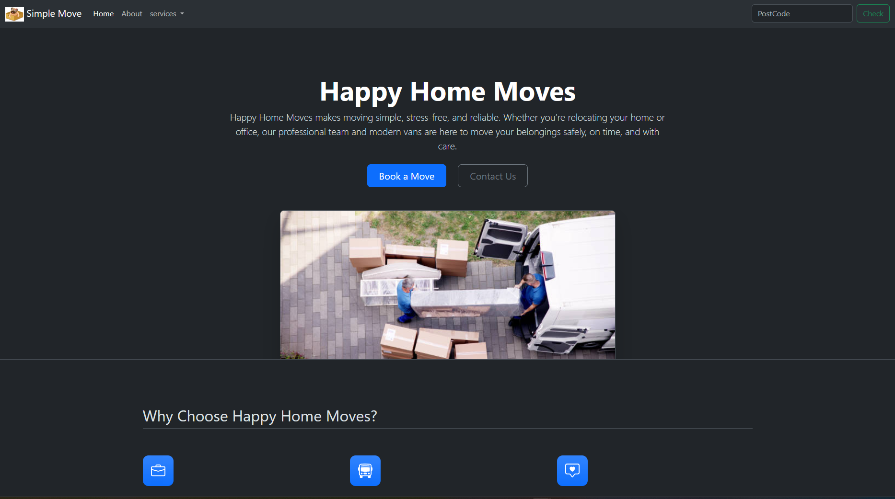
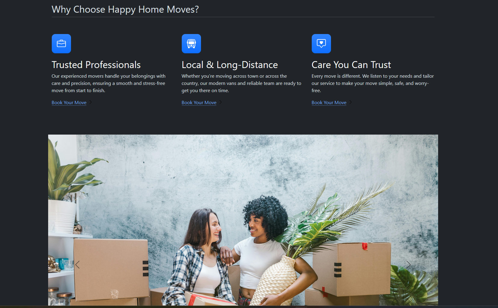
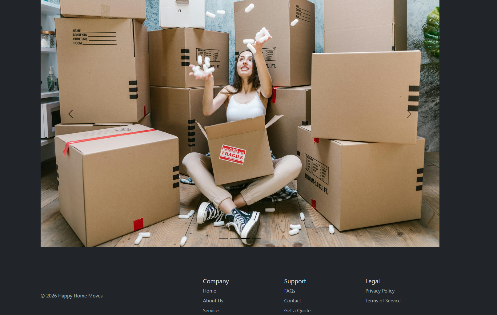

Paste this:
# Home Delivery Website 🚚

A responsive home delivery service website built using **HTML, CSS, and Bootstrap**.
The project focuses on clean layout, user-friendly navigation, and modern UI components.

## ✨ Features
- Responsive navigation bar with dropdown
- Hero section with call-to-action buttons
- Feature highlights section
- Clean footer layout

## 🛠 Technologies Used
- HTML5
- CSS3
- Bootstrap 5
## 📸 Screenshots

### Homepage

### Features Section

### Services Dropdown

